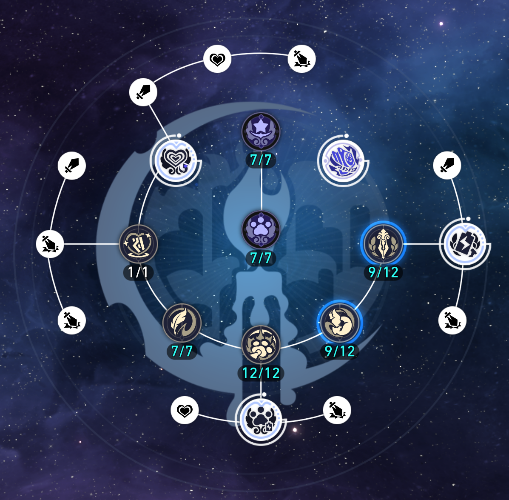

# {{ $frontmatter.title }}

星铁里面的技能树在游戏中被称为行迹，主要由 **技能、额外能力（大行迹）、属性加成（小行迹）** 构成。

对技能树的解析会直接影响我们在 UI 上对技能组和大小行迹的展示。这里我们挑选一个最有代表性的技能树——记忆主的行迹图，来看一看。



技能树上面的每个圈圈都是一个**节点**。在技能树的配置文件 `AvatarSkillTreeConfig.json` 里面，节点就是配置的最小单位。

## 节点

我们先从技能节点开始，也就是 **普攻/战技/终结技/天赋/秘技/忆灵技/忆灵天赋** 对应的节点。和技能配置一样，它们也是每个等级都有一份配置；如下是记忆主的 6 级普攻节点的配置。

```
  {
    "PointID": 8008001,
    "Level": 6,
    "AvatarID": 8008,
    "PointType": 2,
    "AnchorType": "Point01",
    "MaxLevel": 6,
    "PrePoint": [],
    "StatusAddList": [],
    "MaterialList": [
      {
        "ItemID": 2,
        "ItemNum": 112000
      },
      {
        "ItemID": 110253,
        "ItemNum": 5
      },
      {
        "ItemID": 111013,
        "ItemNum": 2
      }
    ],
    "AvatarPromotionLimit": 6,
    "LevelUpSkillID": [
      800801,
      800808
    ],
    "IconPath": "SpriteOutput/SkillIcons/Avatar/8007/SkillIcon_8007_Normal.png",
    "PointName": "",
    "PointDesc": "",
    "SimplePointDesc": "",
    "ExtraEffectIDList": [],
    "SimpleExtraEffectIDList": [],
    "RecommendPriority": 3,
    "AbilityName": "",
    "PointTriggerKey": "PointNormal",
    "ParamList": []
  }
```

需要关注的字段有以下几个：
- `PointID`
- `Level`
- `AvatarID`
- `PointType`
- `MaxLevel`
- `PrePoint`
- `AvatarPromotionLimit`
- `LevelUpSkillID`

其中，`PointID` 就是这个节点的 ID；`AvatarID` 指明这个节点是属于哪位角色的技能树，这里 `8008` 代表的是记忆命途的**星**（`8007` 则是穹）。

`Level` 当然指的就是等级，`MaxLevel` 是该节点的最大等级，这也不必多说。

`PointType` 实质上是一个枚举字段~~（虽然我不知道为什么他们要用一个干巴巴的数字来枚举）~~，取值为范围为 `1, 2, 3, 4, 5`。各个取值的含义如下：
- `1`：**属性加成** 节点（小行迹）
- `2`：**普攻/战技/终结技/天赋/秘技** 节点
- `3`：**额外能力** 节点（大行迹）
- `4`：**忆灵技/忆灵天赋/欢愉技** 节点
- `5`：目前全游仅此一份的记忆主第四个额外能力（未完的尾声）节点

`PrePoint` 表示解锁该节点需要解锁的前置节点 ID。技能组的节点显然不需要前置节点就能直接解锁。

`AvatarPromotionLimit` 表示解锁该节点需要的角色晋阶等级；最显著的应用就是那三个额外能力的解锁需求，分别是角色晋阶 2，角色晋阶 4，角色晋阶 6。

`LevelUpSkillID` 表示此节点关联到的角色技能，可以有多个。本例中，普攻节点就同时关联到了记忆主的普攻和强化普攻两个技能。

--------

其他节点类型的配置也是类似的，你可以通过过滤 `PointType` 来寻找对应类型的节点，并尝试自己解析。
